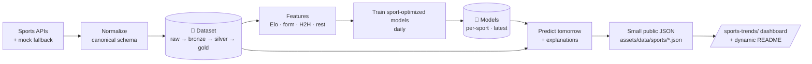

<div align="center">

# ⚽🏀🎾 Ruslan Magana Sports Intelligence

### Tomorrow's Biggest Games — predicted by AI, refreshed every day.

**AI match predictions · live results · trending games — updated every 30 minutes.**

[](https://github.com/ruslanmv/sports-trends/actions/workflows/sports-daily-pipeline.yml)
[](https://github.com/ruslanmv/sports-trends/actions/workflows/sports-live-refresh.yml)
[](https://ruslanmv.com/sports-trends/)
[](https://huggingface.co/datasets/ruslanmv/sports-trends-dataset)
[](https://huggingface.co/ruslanmv/sports-trends-models)
[](LICENSE)

<!-- UPDATED:START -->
_Last updated: **2026-07-06 07:59 UTC** — refreshed automatically every day._
<!-- UPDATED:END -->

</div>

---

## 🗓️ Always in season

> The portal is **season-aware year-round**: when the World Cup ends it rolls to the club season, tennis Slams, NBA, IPL, and back to qualifiers — automatically, from a built-in tournament calendar. Updated daily.

<!-- SEASON:START -->
**🔥 Featured right now:** 🏆 **FIFA World Cup** (football)

**In season today:**

🏆 FIFA World Cup · 🎾 Wimbledon · ⚾ MLB · 🎮 Esports Majors

**Starting soon:**

Premier League (in 35d) · La Liga (in 40d) · Ligue 1 (in 40d) · Serie A (in 43d)
<!-- SEASON:END -->

---

## 🔮 Tomorrow's Top 5 AI Predictions

> Auto-generated every day by the prediction pipeline from freshly trained, sport-optimized models.

<!-- TOP5:START -->
| # | Match | League | Kickoff | AI Pick | Confidence |
|:-:|:------|:-------|:-------:|:--------|:-----------|
| 1 | ⚽ **Lincoln Red Imps** vs **Inter Club d'Escaldes** | UEFA Champions League | 16:00 | Lincoln Red Imps favoured | `██████░░░░` 60% |
<!-- TOP5:END -->

<div align="center"><a href="https://ruslanmv.com/sports-trends/"><b>▶ See the full live dashboard →</b></a></div>

---

## 🏆 FIFA World Cup 2026 — Knockout Predictions

> International matches get a dedicated model: **90-minute result** *plus* a **to-advance** layer (extra time / penalties), group standings, and qualifier odds. Free data via OpenFootball, upgraded to live when an API key is set.

<!-- WORLDCUP:START -->
| Tie | Stage | 90' result | To advance |
|:----|:-----:|:-----------|:-----------|
| ⚽ Portugal vs Spain | Round Of 16 | Portugal 34% · draw 26% · Spain 40% | **Spain** 55% · **Portugal** 46% |
| ⚽ France vs Morocco | Quarterfinals | France 54% · draw 19% · Morocco 27% | **France** 70% · **Morocco** 30% |
| ⚽ Argentina vs Egypt | Round Of 16 | Argentina 63% · draw 14% · Egypt 22% | **Argentina** 79% · **Egypt** 21% |
<!-- WORLDCUP:END -->

<div align="center"><a href="https://ruslanmv.com/sports-trends/sports/football/world-cup/"><b>▶ Full World Cup board →</b></a></div>

---

## 🧠 Sport-Optimized Models

Every sport has different dynamics, so **each game type gets its own model** — retrained daily and published to the
[🤗 model registry](https://huggingface.co/ruslanmv/sports-trends-models) under `<sport>/latest/`.

<!-- MODELS:START -->
| Sport | Model | Algorithm | Task | Latest accuracy |
|:------|:------|:----------|:-----|:---------------:|
| ⚽ Football | `football-hgb` | hist_gradient_boosting | multiclass: home / draw / away | 1.000 |
| 🏀 Basketball | `basketball-logreg` | logistic_regression | binary: home / away win | 1.000 |
| 🎾 Tennis | `tennis-gbdt` | gradient_boosting | binary: player 1 / player 2 win | 1.000 |
| 🏏 Cricket | `cricket-rf` | random_forest | binary: home / away win | 1.000 |
<!-- MODELS:END -->

All probabilities are **calibrated** (isotonic / sigmoid) so the published win chances are trustworthy. Predictions are
informational only — **not betting advice**.

---

## ✨ What it does

- 🗓️ **Tomorrow's biggest games**, ranked by global interest, league importance, social velocity, and model confidence.
- 📡 **Live results** for football, basketball, tennis, cricket, baseball & esports — refreshed every 30 minutes.
- 🔥 **Trending matches** worldwide with audience and momentum.
- 🤖 **Daily-retrained ML models**, one per sport, with explainable win probabilities.
- 🎨 **Premium dashboard** that matches the RuslanMV design language — served as static JSON for instant loads.

## 🏗️ Architecture



GitHub keeps only **code, workflows, the UI, and small JSON**. All large data and model artifacts live in Hugging Face.

## 🔁 Three cadences

| Cadence | What runs | Output |
|:--|:--|:--|
| **Every 30 min** | fetch live → normalize → publish | `live/today/status.json`, raw partitions to HF |
| **Every day** | refresh dataset → features → **train + publish models** → predict tomorrow → update README | `tomorrow/predictions/trending.json`, `models.json`, fresh HF models |
| **Weekly** | deep retrain over full history | benchmarked models to HF |

> 💡 The **daily** cadence guarantees there is always a freshly trained model and an up-to-date prediction set — the
> Top-5 table above is rewritten on every run.

## 🚀 Quick start

```bash
make install   # Python deps + Ruby/Jekyll gems
make serve     # generate JSON, then serve the dashboard
               # → http://127.0.0.1:4000/sports-trends/
```

No Ruby? `make preview` runs a zero-dependency Python server. Everything works **offline** with realistic mock data —
no API keys or tokens required.

```bash
# Run the daily pipeline locally (dry-run, no Hugging Face writes):
export PYTHONPATH=src
python scripts/run_build_training_dataset.py --dry-run
python scripts/run_train_models.py --dry-run        # trains the sport-optimized models
python scripts/run_predict_tomorrow.py              # writes tomorrow.json + predictions.json
python scripts/update_readme.py                     # refreshes this README's dynamic blocks
```

### 🤗 Hugging Face integration

With `HF_TOKEN` set, the same scripts upload for real:

- **Dataset** → [`ruslanmv/sports-trends-dataset`](https://huggingface.co/datasets/ruslanmv/sports-trends-dataset): raw + `gold/training` Parquet + `quality/` + `registry/`.
- **Models** → [`ruslanmv/sports-trends-models`](https://huggingface.co/ruslanmv/sports-trends-models): `<sport>/latest/{model.pkl, feature_schema.json, metrics.json, README.md}` + `registry/latest_versions.json`.

Without a token, every script runs in **dry-run** against local `.data_lake/` and `.models/` (both gitignored).

**Enable the live daily pipeline** by adding the `HF_TOKEN` Actions secret:
```bash
export HF_TOKEN=hf_xxxxxxxx
./scripts/setup_github_secrets.sh ruslanmv/sports-trends
```
or via `Settings → Secrets and variables → Actions → New repository secret` (name `HF_TOKEN`).

## 📡 Free data sources (year-round, verified reachable)

| Source | Key? | Covers | Status |
|--------|------|--------|--------|
| [OpenFootball](https://github.com/openfootball/football.json) | none | Soccer leagues + World Cup (many seasons) | ✅ HTTP 200, public domain |
| [TheSportsDB](https://www.thesportsdb.com/free_sports_api) | none (free key) | Multi-sport upcoming + finished results | ✅ reachable, keyless |
| [TheStatsAPI](https://www.thestatsapi.com/world-cup/data) | none (attribution) | World Cup 2026 fixtures + kickoff times | ✅ reachable, keyless |
| [football-data.org](https://www.football-data.org) | free token | Top leagues + WC fixtures/tables | 🔑 reachable (403 w/o token) |
| [API-Football](https://www.api-football.com) | free key (100/day) | Best live incl. World Cup | 🔑 reachable (403 w/o key) |

The provider stack tries the richest available source and **always falls back** to
the next, ending at bundled mock data — so the portal works with or without keys.
In production only the publishing steps set **`SPORTS_ENABLE_LIVE_FEED=1`**, so
the public dashboard is built from the **real keyless feeds** (TheSportsDB for
leagues, OpenFootball + TheStatsAPI for the World Cup); deterministic mock data
is the safety net for offline/CI, empty responses, and free-tier rate limits.
Tests force **`SPORTS_DISABLE_NETWORK=1`** so CI never consumes third-party quota.
A built-in **tournament calendar** (`features/sports_calendar.py`) keeps the
featured competition correct all year: World Cup → club leagues → tennis Slams →
NBA → IPL → qualifiers, automatically. The models learn continuously via a
[prediction feedback loop](docs/FEEDBACK_LOOP.md) (log → reconcile → retrain).


### Free-tier API key policy

The project should prefer free, public, or keyless sources. For TheSportsDB, keep
`THESPORTSDB_KEY` unset to use the public free/test key, or create a free account
at [TheSportsDB](https://www.thesportsdb.com/) and copy the key from your user
profile if you need your own free key. If TheSportsDB returns HTTP 429, do **not**
fail the build and do **not** add a paid-only dependency: reduce live-feed calls,
let the provider fall back to bundled mock data, and keep tests network-disabled.

## 🗂️ Project layout

```
sports/                 Jekyll pages (index, per-sport, match/league SEO pages)
_layouts/ _includes/    Dashboard layout + components
assets/css|js           Premium UI (JSON-driven, graceful fallback)
assets/data/sports/     Small public JSON the site + README consume
src/sports_trends/      providers · ingestion · features · datasets · models · inference · seo · social
scripts/                Pipeline entry points (one per stage)
.github/workflows/      11 automated workflows (30-min / daily / weekly)
docs/                   Architecture, ML pipeline, data schema, SEO, legal
```

## 🧪 Quality

- ✅ Leakage-safe features (a test plants a future blowout and proves it's ignored).
- ✅ JSON Schema validation on every public file.
- ✅ 30+ unit tests across providers, normalization, features, training, inference, SEO.
- 📚 Full docs in [`docs/`](docs/) — see [`ML_PIPELINE.md`](docs/ML_PIPELINE.md) and [`HF_DATASET_ARCHITECTURE.md`](docs/HF_DATASET_ARCHITECTURE.md).

## 🚀 Deploy to production

Served entirely from **this repo** via **GitHub Pages** at
**https://ruslanmv.com/sports-trends/** (no commits ever go into
`ruslanmv.github.io`). The site is baseurl-aware (`baseurl: /sports-trends`) and
the dashboard is the project root, so nothing 404s.

**One-time:** push to `main`, then **Settings → Pages → Source = GitHub Actions**.
The *Sports Deploy (GitHub Pages)* workflow builds + publishes it. The data
pipeline is already live via Actions + `HF_TOKEN`. Full guide:
[`docs/DEPLOYMENT.md`](docs/DEPLOYMENT.md).

## ⚖️ Disclaimer

Predictions are generated for **informational and entertainment purposes only**. They are **not** betting, gambling,
or financial advice, and are not guarantees of any outcome. See [`docs/LEGAL_DISCLAIMER.md`](docs/LEGAL_DISCLAIMER.md).

<div align="center"><sub>Built by <a href="https://ruslanmv.com">Ruslan Magana Vsevolodovna</a> · powered by Hugging Face 🤗 + GitHub Actions ⚙️</sub></div>
